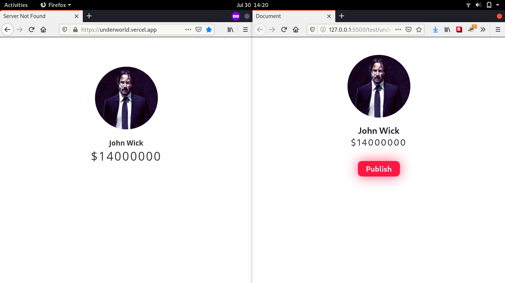

# MQTT Project Example Using Javascript

These are a simple experiment when learning MQTT in some use case such as controlling LED, traffic light, and broadcasting message.

## [LED Control](light_control)

This project is using Website to control Arduino WeMos D1 to turn LED on and off

## [Traffic Light](traffic_light)

This is project example of traffic light simulation control using website and Arduino WeMos D1

## [Broadcasting](underworld)

This is an example of broadcasting message using MQTT with NextJS, inspired by John Wick Movie when Winston announced that John had become excommunicado
